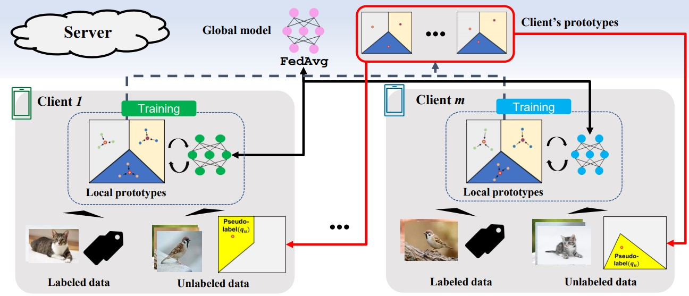
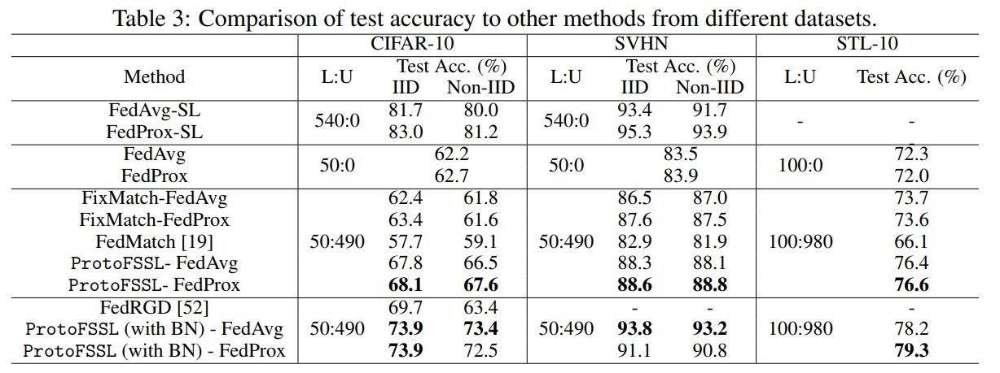

# ProtoFSSL: Federated Semi-Supervised Learning with Prototype-based Consistency Regularization
This repository is the official implementation of *ProtoFSSL: Federated Semi-Supervised Learning with Prototype-based Consistency Regularization*.

**Overall design of *ProtoFSSL*.**



## Requirements

To install requirements:

```setup
conda env create -f environment_protofssl.yaml
```


## Training

### ProtoFSSL
To train the models in the paper, run this command:

```
python proto_fssl.py --exp_name name_you_want --dataset cifar10
```
You can select dataset using `--dataset` argument. If you want non-iid distribution of unlabeled data, use `--non_iid` argument.
If you want FedProx framework, use `--fl_framework` argument (default is FedAvg).
```
python proto_fssl.py --exp_name name_you_want --dataset cifar10 --model res9 --fl_framework fedprox --non_iid
```

### Other methods
If you want to use other methods that appears in the paper, check input arguments or `run_training.sh` files.  
For FixMatch[[1]](#reference) method, we use codes in `./fixmatch/` directory. Use this command:
```
python fixmatch_cifar10.py name_you_want fedavg iid
```
You can use `fedprox` instead of `fedavg` and `noniid` instead of `iid`.  
For FedMatch[[2]](#reference), we use their [official code](https://github.com/wyjeong/FedMatch) in the paper.


### Summary of input arguments
```
exp_name: Experiment name
dataset: The name of the datset. One of [cifar10, svhn, stl10], default: cifar10
model: Model type. One of [res9, res18, wres28x2], default: res9
bn_type: Batch normalization type one of [bn, sbn, gn], default: None
non_iid: Run non-iid distributed data
num_round: Number of training round, default: 300
num_label: Number of labeled data per client per class, default: 5
num_unlabel: Number of unlabeled data per client, default: 490
local_episode: Number of local episode, default: 10
unlabel_round: Starting training round to use unlabeled data(non-inclusive), default: 0
optimizer: Which optimizer to use(rmsprop, sgd, adam), default: rmsprop
opt_lr: Learning rate for optimizer, default: 1e-3
num_client: Number of clients, default: 100
num_active_client: Number of active clients, default: 5
unlabel_loss_type: Loss type to train unlabeled data. one of [CE, MSE], default: CE
is_sl: Whether to do supervised learning
fl_framework: Federated Learning framework. One of [fedavg, fedprox], default: fedavg
mu: Regularization hyperparameter for fedprox, default: 1e-3
s_label: Number of samples for support set in each episode, default: 1
q_label: Number of samples for query set in each episode, default: 2
q_unlabel: Number of samples for query set from unlabeled data in each episode, default: 100
use_noise: Whether to add gaussian noise to prototypes when sending to server, default: False
stddev: Stddev of gaussian noise for prorotypes, default: 0.0
```

## Evaluation

The results are saved in `result` folder. There will be three files: training, validation, and test accuracy. Each time the validation accuracy updates the highest value, the test account is recorded. So, the final test accuracy is at the end of the file of the test accuracy.


## Results

Our model achieves the following performance on :
  


## Reference

[1] Sohn, Kihyuk, et al. "Fixmatch: Simplifying semi-supervised learning with consistency and confidence." Advances in Neural Information Processing Systems 33 (2020): 596-608.
[2] Jeong, Wonyong, et al. "Federated semi-supervised learning with inter-client consistency & disjoint learning." arXiv preprint arXiv:2006.12097 (2020).
